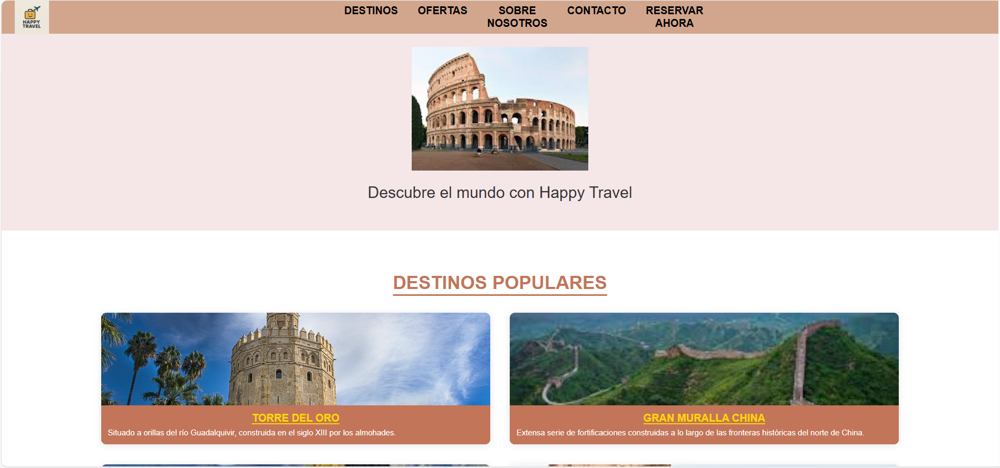

# HappyTravel

Bienvenidos a mi proyecto de digitalización del tercer trimestre: una landing page para HappyTravel.

# Descripción del proyecto

He desarollado esta página web usando HTML y CSS para mostrar información sobre destinos turísticos de manera atractiva.
El objetivo era simular una página web de agencia de viajes, y es lo que he intentado replicar al máximo, usando imágenes enlazadas desde Cloudinary para que se aprecie mejor, con un archivo de estilos "css" donde apliqué todos los estilos.

También al subir los cambios al repositorio, hize los commits en inglés para mayor legibilidad.

# Características del proyecto

En primer lugar, se encuentra la página de inicio, con el logo de HappyTravel arriba a la izquierda, un menú sencillo para que el usuario pueda ir directamente a lo que le interese, y una imagen destacada junto a un mensaje inspirador.

Después, incluí una sección de destinos populares (los cuales podrán variar a lo largo del tiempo), con una breve descripción, para atraer la atención de usuarios indecisos por su próximo viaje.

Tras esto, añadí una sección de ofertas, que incluye descuentos temporales que los usuarios podrán aprovechar, y cambiarán a lo largo del tiempo.

Tras esto, añadí un apartado de sección de contacto, donde opcionalmente si el usuario quiere recibir notificaciones acerca de la web (descuentos,viajes...) solo deberá escribir su correo electrónico para suscribirse.

Por último, en el footer agregue un pequeño menú donde los usuarios podrán informarse más acerca de HappyTravel, y las redes sociales de HappyTravel.

Todos estos cambios los acompañe de imágenes y una paleta de colores cálidos, y usé estilos CSS para mayor comodidad (estilos al pasar el cursor, imágenes que se mueven al pasar el cursor...)

# Tecnologías utilizadas

- HTML: para la estructura básica ("index.html")
- CSS: para estilos y animaciones ("styles.css")

# Experiencia obtenida

Durante este proyecto, mejore mis conocimientos de CSS, sobre todo en:

- Efectos de hover y transiciones suaves.
- Posicionamientos de elementos con flexbox y grid.
- Manejo de imágenes.
- Crecaión de formularios.
- Uso de efectos.

# Captura de pantalla 

Esta es la captura de pantalla de la página final:

# Conclusión final

Este proyecto fue un verdadero desafío, y me ayudo a mejorar mi conocimiento sobre CSS principalmente, también mejoré más usando Figma (en la creación de la Landing Page) y GitHub (asimilando mejor los comandos para subir los cambios al repositorio)
